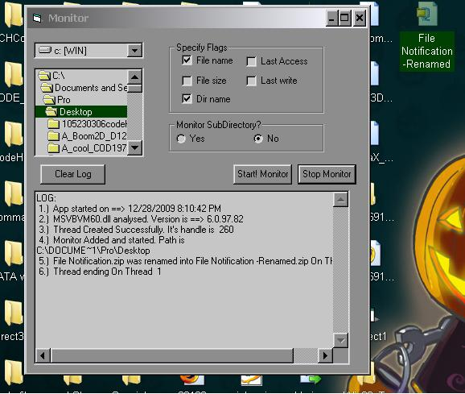



## Creating Thread in VB6 Successfully With an Example

### Description

Creates and uses a thread (safely)
 
### More Info
 
Creating threads in VB6 using CreateThread. I know that simply using CreateThread doesn't works with VB and crashes VB but I have successfully created and used the thread to Monitor FileSystem Changes (using ReadDirectoryChangesW). This is a complicated piece of code and beginners can take up a lot of time understanding it (Specially if you don't know much about APIs and etcs). However, it must be used cautiously so I would ADVISE EVERYONE TO READ THE README AND OTHER DOCUMENTATIONS CAREFULLLY. After some more releases I think it will be completely safe to use this code. Take a look at it and send any comments to me via PSC. And do vote. Hope you will find this code useful.

Thanks

             |
---                |---
**Submitted On**   |2009-02-08 19:19:16
**By**             |[Pravesh Koirala](https://github.com/Planet-Source-Code/PSCIndex/blob/master/ByAuthor/pravesh-koirala.md)
**Level**          |Advanced
**User Rating**    |4.2 (21 globes from 5 users)
**Compatibility**  |VB 6\.0
**Category**       |[Windows API Call/ Explanation](https://github.com/Planet-Source-Code/PSCIndex/blob/master/ByCategory/windows-api-call-explanation__1-39.md)
**World**          |[Visual Basic](https://github.com/Planet-Source-Code/PSCIndex/blob/master/ByWorld/visual-basic.md)
**Archive File**   |[Creating\_T21713612282009\.zip](https://github.com/Planet-Source-Code/pravesh-koirala-creating-thread-in-vb6-successfully-with-an-example__1-72776/archive/master.zip)

